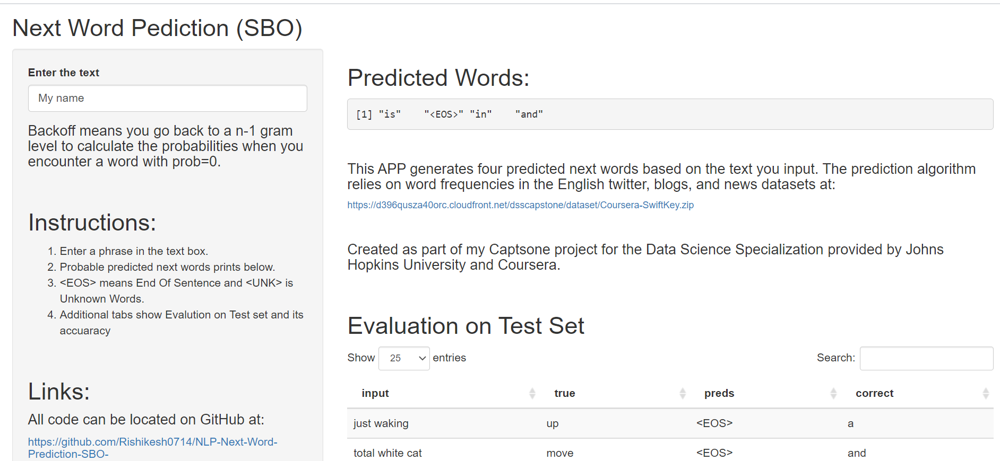

---
output:
  html_document: default
  pdf_document: default
---
Capestone - Next Word Prediction N-gram model (SBO)
========================================================
author: Rishikesh Pillay
date: 25/09/2021
autosize: true

Introduction
========================================================

Next word prediction app generates four predicted next words based on the text you input. The prediction algorithm relies on word frequencies in the English twitter, blogs, and news datasets  provided by Swiftkey.

The word prediction algorithm used in my Next Word Prediction app is a simplified version of Katz's Back-Off algorithm, referred to as Stupid Back-Off (SBO).

<h6>Link<h6>

- App : <https://rishikesh.shinyapps.io/Next_Word_Prediction_SBO/>
- Github : <https://github.com/Rishikesh0714/NLP-Next-Word-Prediction-SBO->


Steps Involve
========================================================

- Reading data from three sources(Twitter, Blog, News) with readlines function and exploring it with visualizing 

- Sub-setting the huge Corpus/Character-Vector and selecting 2 percent of all the sources each

- Next I Clean the data :In cleansing process, I made use of the 'tm' package commands to remove any hash tags, convert all text into lower case, remove any numbering, remove any white-spaces, removing "Mojibake" for  (double -quotes) character and remove hyperlinks (https) characters.

- Split the data into train and test in 75% - 25% split

- Train the model Stupid Back-off N-gram models in R (Package = "SBO") with N = 5gram and dict = target ~ 80%

- sbo_predatable is very useful function to save model object in memory (the training process is computationally expensive, one may want to save the text predictor object)

- Deploy the Model on the shinny app

How to Use APP
========================================================


1. Enter a phrase in the text box.
2. Probable predicted next words prints below.
3. < EOS > means End Of Sentence and < UNK > is Unknown Words.
4. Additional tabs show Evaluation on Test set and its accuracy.



N-Gram and Back-off
========================================================

An <b>N-gram model</b> is built by counting how often word sequences occur in corpus text and then estimating the probabilities. Since a simple N-gram model has limitations, improvements are often made via smoothing, interpolation and backoff.

A model that simply relies on how often a word occurs without looking at previous words is called unigram. If a model considers only the previous word to predict the current word, then it's called bigram. If two previous words are considered, then it's a trigram model.

Let's say you are using 4-grams to calculate the probability of a word in text. You have "this is a very" followed by "sunny". Let's say "sunny" never ocurred in the context "this is a very" so for the 4-grams model "sunny" has probability 0, and that's not good because we know that "sunny" is more probable than say "giraffe".

<b>Backoff</b> means you go back to a n-1 gram level to calculate the probabilities when you encounter a word with prob=0. So in our case you will use a 3-gram model to calculate the probability of "sunny" in the context "is a very".

The most used scheme is called "stupid backoff" and whenever you go back 1 level you multiply the odds by 0.4. So if sunny exists in the 3-gram model the probability would be 0.4 * P("sunny"|"is a very").

You can go back to the unigram model if needed multiplying by 0.4^n where n is the number of times you backed off.<h10>

Notes/Points I Learned
========================================================

- I used sbo package which was availble in R and These objects are a "raw" equivalent of a text predictor.

- Also I didn't Removed Punctuation as it was indicating End of sentences in the model, employed for sentence tokenization (moreover, text belonging to different entries of the preprocessed input vector are understood to belong to different sentences).

- I didn't remove stopwords as it is useful for predicting next word which is usually done in bag of words model  


- Running time of Model Building sbo_predtable is  2.90852351586024  min.  Maxium time is taken for converting VCorpus to corpus in Model building  11.4243470152219  min 


Summary of predictable object
========================================================

```r
load('sbo_model.rda')
summary(t)
```

```
Next-word prediction table from Stupid Back-off N-gram model

Order (N): 5 
Dictionary size: 2003  words
Back-off penalization (lambda): 0.4 
Maximum number of predictions (L): 4 

Object size: 36 Mb 

See ?predict.sbo_predictor for usage help.
```


